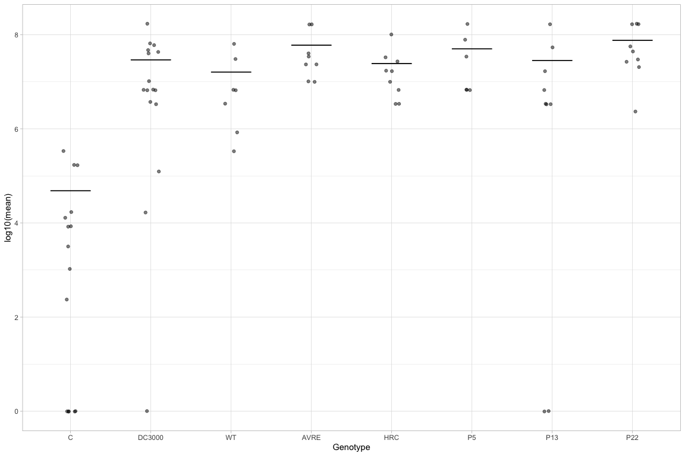

Read in map of who was where

```r
fileUrl <- ("https://docs.google.com/spreadsheets/d/1ar1stJXBPljPWMtrY5QcABxTfU-0Wv7GUyQ6Y6AbXvI/edit#gid=0")

fileCSV <- read_sheet(ss = fileUrl)

pos_genot_map=fileCSV[,c("position","Genotype")]
```

Read in data from green pixels and merge with pos map

```r
green_pixels = read.table("~/work_main/abt6_projects8/Pseudomonas_mapping/data/infection_experiments/august_2019/process_pixels_all.csv", sep="\t", header=T)

green_pixels = merge(pos_genot_map, green_pixels, by.x = "position", by.y = "position")

green_pixels = subset(green_pixels, Genotype!="NA")

greenp_ww = green_pixels[green_pixels$Plate %in% c("plate1_1_uncover_23082019", "plate1_2_uncover_2382019"),]

greenp_mutant = green_pixels[green_pixels$Plate %in% c("plate2_1_uncover_2382019", "plate3_2_uncover_2382019"),]
```

Now plot the green pixels

```r
greenp_mutant$Genotype = as.factor(greenp_mutant$Genotype)

greenp_mutant$Genotype = factor(greenp_mutant$Genotype, levels = c("C", "DC3000", "WT", "AVRE", "HRC"))

the_means = greenp_mutant %>% group_by(Genotype) %>% dplyr::summarise(mean = mean(Green_pixels, na.rm=T), se = sd(Green_pixels, na.rm=T) / length(Green_pixels)) 

base = ggplot(data = the_means, aes(x=Genotype, y=mean, colour=Genotype))

p2 = base + geom_errorbar(aes(ymin=mean, ymax=mean), width=.5) +
 theme_light() + 
  geom_jitter(data = greenp_mutant, aes(x=Genotype, y=Green_pixels), width=0.1, alpha=0.5) + 
  ylab("Green Pixel Number") +
  scale_color_manual(values = mycolors) 

p2
```

<!-- -->

Let's do a comparison between the avrE and hrc with WT

```r
greenp_mutant_WT = subset(greenp_mutant, Genotype=="WT")
greenp_mutant_AVRE = subset(greenp_mutant, Genotype=="AVRE")
greenp_mutant_hrc = subset(greenp_mutant, Genotype=="HRC")

wilcox.test(greenp_mutant_WT$Green_pixels, greenp_mutant_hrc$Green_pixels)
```

```
## 
## 	Wilcoxon rank sum test with continuity correction
## 
## data:  greenp_mutant_WT$Green_pixels and greenp_mutant_hrc$Green_pixels
## W = 19, p-value = 0.2037
## alternative hypothesis: true location shift is not equal to 0
```

```r
wilcox.test(greenp_mutant_WT$Green_pixels, greenp_mutant_AVRE$Green_pixels)
```

```
## 
## 	Wilcoxon rank sum test with continuity correction
## 
## data:  greenp_mutant_WT$Green_pixels and greenp_mutant_AVRE$Green_pixels
## W = 19, p-value = 0.3235
## alternative hypothesis: true location shift is not equal to 0
```


Now let's look at colonies from 8.26.2019

```r
cfu = fileCSV[,c("Genotype", "Base_calc", "dil1_calc", "dil2_calc", "dil3_calc", "dil4_calc")]

real_cfu = cfu %>% rowwise() %>% dplyr::summarise(max = max(Base_calc, dil1_calc, dil2_calc, dil3_calc, dil4_calc, na.rm = TRUE))

cfu$cfu_calc = real_cfu$max

cfu$Genotype = factor(cfu$Genotype, levels = c("C", "DC3000", "WT", "AVRE", "HRC", "P5", "P13", "P22"))

cfu = subset(cfu, Genotype!="NA")

cfu_means = cfu %>% group_by(Genotype) %>% dplyr::summarise(mean = mean(cfu_calc, na.rm=T), se = sd(cfu_calc, na.rm=T) / length(cfu_calc))

cfu_alone = ggplot(data = cfu_means, aes(x=Genotype, y=log10(mean))) +
  geom_errorbar(aes(ymin=log10(mean), ymax=log10(mean), width=.5)) +
 theme_light() + 
  geom_jitter(data = cfu, aes(x=Genotype, y=log10(cfu_calc+1)), width=0.1, alpha=0.5) + 
  scale_color_manual(values = mycolors) 

cfu_alone
```

<!-- -->

